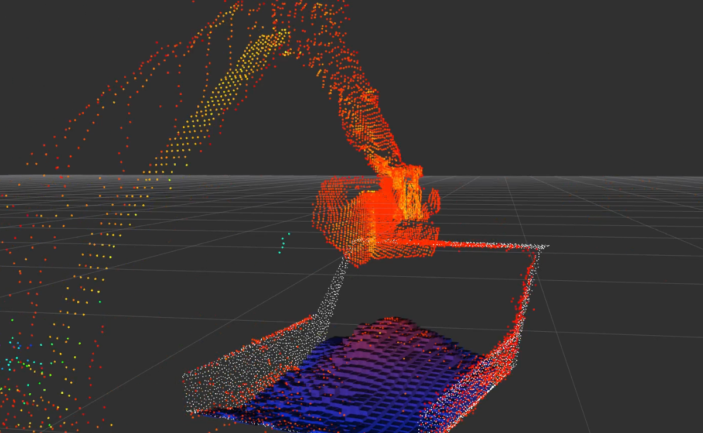

# mst110cr_loadsense

Recognize a dump truck bed from LiDAR point clouds and estimate the volume of its load.

ダンプトラックの荷台を LiDAR の点群から認識し、積載物の体積を推定  



## Build & Install

```bash
# ROS Humbleを読み込み
source /opt/ros/humble/setup.bash

# ワークスペースを作成
mkdir -p ~/humble_ws/src

# Clone
cd ~/humble_ws/src
git clone https://github.com/pwri-opera/mst110cr_loadsense.git

# 必要に応じて依存関係をインストール
# rosdep install --from-paths src --ignore-src -r -y

# Build
cd ~/humble_ws
colcon build --symlink-install && source install/setup.bash

# 起動 (launch)
ros2 launch mst110cr_loadsense loadsense_launch.py
```

## Usage

`dump_bed_calibrator`(荷台位置のキャリブレーション) と `load_volume_estimator`(積載量推定) を同時に起動

```bash
ros2 launch mst110cr_loadsense loadsense_launch.py \
  params_file:=/absolute/path/to/loadsense.yaml \
  use_sim_time:=true
```

| 引数 | 既定値 | 説明 |
| --- | --- | --- |
| `params_file` | パッケージ内の `param/loadsense.yaml` | 使用するパラメータ YAML の絶対パス |
| `use_sim_time` | `false` | `true` の場合、両ノードでシミュレーション時刻を使用 |

- launch 引数の `use_sim_time` は YAML 内の値より後に適用されるため、launch から指定した値が優先
- 同梱 YAML の `template_path` と `bed_mesh_path` は絶対パスで記載されているため、配置先に合わせて修正


## ROS2 Node

### `dump_bed_calibrator`
LiDAR 点群と荷台のテンプレート点群を coarse/fine の 2 段階 GICP で位置合わせし、`target_frame_id`（荷台）から `source_frame_id`（LiDAR）への TF を配信
  - 位置合わせは常時/自動実行しない．`calibrate` Serviceを呼び出したときに最新の点群を使って実行される

#### ros2 run

```bash
ros2 run mst110cr_loadsense dump_bed_calibrator --ros-args \
  --params-file /absolute/path/to/loadsense.yaml
```

点群を1回以上受信した後、`/calibrate` サービスを呼び出して GICP キャリブレーションを実行

```bash
ros2 service call /calibrate std_srvs/srv/Trigger '{}'
```


### `load_volume_estimator`

- 点群を TF で荷台座標系へ変換して荷台内の点群のみ切り出す
- XY グリッドごとの積載物表面と、荷台メッシュから生成した底面ハイトマップとの差を積分し、体積を算出

#### ros2 run
```bash
ros2 run mst110cr_loadsense load_volume_estimator --ros-args \
  --params-file /absolute/path/to/loadsense.yaml
```

## Topic /Service

積載量は独自の型(`mst110cr_loadsense/msg/FloatStamped`)で出力しているため，注意

| ノード | 種別 | 名前（既定値） | 型 | 説明 |
| --- | --- | --- | --- | --- |
| `dump_bed_calibrator` | Topic (in) | `/rslidar_points` | `sensor_msgs/msg/PointCloud2` | キャリブレーションに使用する LiDAR 点群 |
| `dump_bed_calibrator` | Service (in) | `calibrate` | `std_srvs/srv/Trigger` | 最新点群で GICP を実行 |
| `dump_bed_calibrator` | Topic (out) | `template_points` | `sensor_msgs/msg/PointCloud2` | 荷台座標系のテンプレート点群 |
| `dump_bed_calibrator` | TF Topic (out) | `dump_bed -> rslidar` | TF | GICP で推定した荷台・LiDAR 間の変換 |
| `load_volume_estimator` | Topic (in) | `/rslidar_points` | `sensor_msgs/msg/PointCloud2` | 体積推定に使用する点群 |
| `load_volume_estimator` | Topic (out) | `load_volume` | `mst110cr_loadsense/msg/FloatStamped` | 推定体積 |
| `load_volume_estimator` | Topic (out) | `clipped_points` | `sensor_msgs/msg/PointCloud2` | 荷台範囲内に切り出した点群 |
| `load_volume_estimator` | Topic (out) | `heightmap_markers` | `visualization_msgs/msg/MarkerArray` | RViz 表示用の積載高ハイトマップ |

## パラメータ

設定例: `param/loadsense.yaml` 

パス、座標範囲、初期姿勢は使用環境に合わせて変更

### `dump_bed_calibrator`


| パラメータ | 既定値 | 説明 |
| --- | --- | --- |
| `input_topic` | `/rslidar_points` | 入力点群トピック |
| `template_path` | "" | GICP の目標となる点群ファイル。実行時に存在するパスを指定 |
| `template_points_topic` | `template_points` | 生のテンプレート点群の出力先 |
| `template_publish_hz` | `1.0` | テンプレート点群の配信周期 [Hz] |
| `source_frame_id` | `rslidar` | 入力点群（LiDAR）のフレーム |
| `target_frame_id` | `loadsense` | テンプレート（荷台）のフレーム |
| `transform_publish_hz` | `10.0` | 最後に採用した TF の再配信周期 [Hz] |
| `require_matching_input_frame` | `true` | 入力 `frame_id` が `source_frame_id` と異なる点群を無視するか |
| `use_input_stamp` | `true` | GICP 成功時の TF に入力点群の時刻を使用。`false` なら現在時刻を使用 |
| `qos_depth` | `1` | 点群用 QoS のキュー深度（1 以上） |
| `qos_reliability` | `best_effort` | 点群用 QoS。`best_effort` または `reliable` |
| `min_input_points` | `100` | フィルタ後に GICP を実行するための最小点数（3 以上） |
| `max_input_points` | `0` | GICP 前の最大点数。超過時は均等に間引く。`0` は制限なし |
| `crop_enabled` | `false` | 入力点群の Crop Box を有効化 |
| `crop_min` | `[-20.0, -20.0, -20.0]` | source 座標における Crop Box の XYZ 最小値 [m] |
| `crop_max` | `[20.0, 20.0, 20.0]` | source 座標における Crop Box の XYZ 最大値 [m] |
| `remove_outliers` | `false` | ボクセル化後の統計的外れ値除去を有効化 |
| `outlier_nb_neighbors` | `20` | 外れ値判定に使用する近傍点数 |
| `outlier_std_ratio` | `2.0` | 外れ値判定の標準偏差倍率 |
| `coarse_voxel_size` | `0.05` | coarse GICP のボクセルサイズ [m] |
| `coarse_max_correspondence_distance` | `0.25` | coarse GICP の最大対応点距離 [m] |
| `coarse_max_iterations` | `80` | coarse GICP の最大反復回数 |
| `fine_voxel_size` | `0.02` | fine GICP のボクセルサイズ [m] |
| `fine_max_correspondence_distance` | `0.08` | fine GICP の最大対応点距離 [m] |
| `fine_max_iterations` | `60` | fine GICP の最大反復回数 |
| `gicp_epsilon` | `0.001` | GICP の共分散正則化値 |
| `relative_fitness` | `1.0e-7` | fitness の相対変化に対する収束閾値 |
| `relative_rmse` | `1.0e-7` | RMSE の相対変化に対する収束閾値 |
| `use_robust_kernel` | `true` | Cauchy ロバストカーネルを使用。未対応の Open3D では自動的に無効化 |
| `robust_kernel_scale` | `0.05` | Cauchy ロバストカーネルのスケール |
| `initial_translation` | `[0.0, 0.0, 0.0]` | source から target への初期並進 `[x, y, z]` [m] |
| `initial_rpy` | `[0.0, 0.0, 0.0]` | source から target への初期姿勢 `[roll, pitch, yaw]` [rad]。回転順は `Rz * Ry * Rx` |
| `use_previous_result_as_initial_guess` | `true` | 前回採用した変換を次回 GICP の初期値に使用 |
| `min_fitness` | `0.10` | GICP 結果を採用する最小 fitness |
| `max_inlier_rmse` | `0.10` | GICP 結果を採用する最大 inlier RMSE [m] |
| `log_every_n` | `1` | 成功ログを出力する成功回数の間隔 |

*TFについて:*
- 変換は `p_target = T_target_source * p_source` で与えられる
- TF は親を `target_frame_id`、子を `source_frame_id` として配信
- __起動直後から最初のキャリブレーション成功までは、初期姿勢による TF を配信__

### `load_volume_estimator`

| パラメータ | 既定値 | 説明 |
| --- | --- | --- |
| `input_topic` | `/rslidar_points` | 入力点群トピック |
| `target_frame_id` | `dump_bed` | 体積計算を行う荷台座標系 |
| `load_volume_topic` | `load_volume` | 推定体積の出力先 |
| `clipped_points_topic` | `clipped_points` | 荷台範囲内の点群の出力先 |
| `heightmap_marker_topic` | `heightmap_markers` | ハイトマップ MarkerArray の出力先 |
| `qos_depth` | `1` | 入出力点群用 QoS のキュー深度（1 以上） |
| `qos_reliability` | `best_effort` | 入出力点群用 QoS。`best_effort` または `reliable` |
| `tf_timeout_sec` | `0.1` | target フレームへ変換するときの TF 待機時間 [s] |
| `use_input_stamp` | `true` | 入力時刻の TF と出力時刻を使用。`false` なら最新 TF と現在時刻を使用 |
| `clip_min` | `[-3.0, -1.5, 0.0]` | target 座標における荷台範囲の XYZ 最小値 [m] |
| `clip_max` | `[3.0, 1.5, 3.0]` | target 座標における荷台範囲の XYZ 最大値 [m] |
| `bed_mesh_path` | "" | 荷台内面の三角形メッシュ。実行時に存在する絶対パスが必要 |
| `heightmap_resolution` | `0.10` | XY ハイトマップのセル幅 [m] |
| `bed_fence_xz_points` | `[-3.0, 1.5, 3.0, 1.5]` | 荷台上端の `[x0, z0, x1, z1, ...]`。x は昇順。端部の補間値を制限 |
| `min_clipped_points` | `10` | 体積を出力するために必要な切り出し後の最小点数 |
| `marker_alpha` | `0.75` | ハイトマップマーカーの透明度（0 より大きく 1 以下） |

- 荷台底面は、起動時にメッシュへ上方から下向きのレイを投射して作成する。
- 積載物表面は各 XY セルの最大 Z とし、欠損セルを補間した後、底面より上の高さをセル面積と掛け合わせて積算し算出
- 両ノードは`use_sim_time` パラメータに対応

## Tool

### `mst110cr_loadsense/tool/add_normals_to_ply.py`

`model/mst110cr_vessel_registration_raw.ply` を読み込み、半径 `0.10` m、最大近傍数 `30` で法線を推定し、カレントディレクトリへ `vessel_template_with_normals.ply` を出力する補助スクリプト

入出力パスと推定条件はスクリプト内に固定

